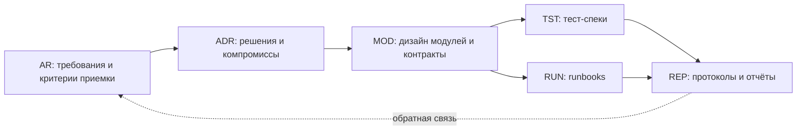
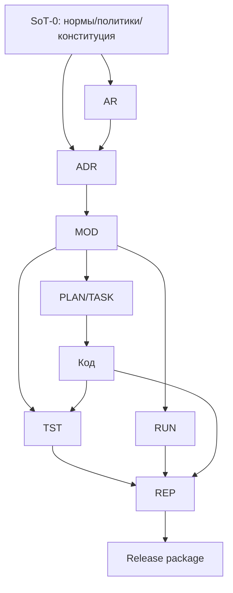

# Методические указания для разработки с применением ИИ  
## Полный документально‑инструментальный контур AI‑First (SDD)

> **Назначение:** дать разработчикам, начинающим AI‑First, быстрый и уверенный старт, который делает разработку с ИИ **управляемой, проверяемой и воспроизводимой**.  
> **Ключевая идея:** в AI‑First главный артефакт — **нормы и спецификация (SoT)**, а код — **производный результат**, который обязан им соответствовать.

**Связанные материалы в репозитории:**
- [Манифест AI‑First](../manifesto.md)
- [Политика данных и безопасность](../policies/data-policy-and-security.md)
- [Концепция внедрения AI‑First для высокотехнологичной R&D‑организации](../../initiatives/tech-rnd/concept.md)
- [План/дорожная карта внедрения](../../initiatives/tech-rnd/implementation-plan.md)
- [Контекст домена (пример: электроника/EDA)](../context/high-tech-rnd-electronics-eda.md)

> Если вы только начинаете: стартуйте с раздела **1 (Core Pack)** и раздела **9 (Gate‑система)**. В них — минимальный набор артефактов и «точки остановки», которые не дают процессу развалиться.

---

## 0. Что такое AI‑First и почему без нормативов он «ломается»

### 0.1. Определение AI‑First
**AI‑First разработка** — это процесс, в котором ИИ системно используется как исполнитель (генерация текста/кода/тестов/конфигов), но:
- действует **в рамках регламентов**,
- получает контекст **из источников истины (SoT)**, а не из разрозненных промптов,
- проходит **обязательные шлюзы проверки (gates)**,
- оставляет **следы**: протоколы, реестры, отчёты.

AI‑First ≠ «автономный агент делает фичу целиком».  
AI‑First = **структурная инженерия**, где автономия модели строго ограничена.

### 0.2. Четыре системные причины, почему «просто попросить модель» не работает
На продакшене практически всегда проявляются 4 ограничения:

1) **Ограничение объёма изменений**  
Качество резко падает, когда один запрос затрагивает много файлов и слоёв.  

2) **Слепые зоны репозитория и стандартов**  
Модель видит код, но не знает «что у нас канонично», если вы не сделали это явным.

3) **Слепота контекста фичи**  
Требования, критерии приёмки, edge cases, интеграционные точки — не выводятся надёжно из «краткого описания».

4) **Неконтролируемая автономия**  
Без остановок и протоколов агент становится «чёрным ящиком»: решения принимаются молча, ошибки выявляются слишком поздно.

**Spec‑Driven Development (SDD)** переносит ясность «вверх по потоку»: сначала нормы и спецификация, затем решения, дизайн, задачи и только потом код.

---

## 1. Быстрый старт: минимальный контур (Core Pack)

Если у вас сегодня нет ничего — начните с **12 обязательных артефактов**. Это минимум, который делает ИИ управляемым.

### 1.1. Core Pack: 12 критичных документов и правил
1) **CONSTITUTION** — конституция проекта (SoT‑0).  
2) **GLOSSARY** — глоссарий домена и проекта (SoT‑0).  
3) **ARCH_BASELINE** — базовая архитектурная карта (SoT‑0).  
4) **QUALITY_BAR** — пороги качества и Definition of Done (SoT‑0).  
5) **SECURITY_BAR** — минимум безопасности/данных/секретов (SoT‑0).  
6) **AI_USAGE_POLICY** — что можно/нельзя отдавать ИИ + правила логирования (SoT‑0).  
7) **REPO_LAYOUT_STANDARD** — где какие артефакты лежат (SoT‑0).  
8) **GATES (policy‑as‑code)** — обязательные gates и их требования (JSON).  
9) **DOC_SCHEMAS** — схемы/правила структуры документов (JSON Schema или эквивалент).  
10) **AR.template** — шаблон требований (SoT‑1).  
11) **ADR.template** — шаблон решений (SoT‑2).  
12) **Traceability tool** — проверка цепочки AR→ADR→MOD→TST/RUN→REP (скрипт + отчёт).

> Пока не готовы все 12 — **не включайте автономную генерацию крупных диффов**. Используйте ИИ только как ассистента для локальных задач.

### 1.2. Минимальная структура репозитория за 15 минут
Создайте каркас (названия можно адаптировать, но смысл сохраняйте):

```text
repo/
  sot/                       # SoT‑0: устойчивые нормы проекта
    CONSTITUTION.md
    GLOSSARY.md
    ARCH_BASELINE.md
    QUALITY_BAR.md
    SECURITY_BAR.md
    AI_USAGE_POLICY.md
    REPO_LAYOUT_STANDARD.md

  policy/                    # policy‑as‑code (машиночитаемые правила)
    gates.json
    docs.schema.json
    dependencies.policy.json
    secrets.policy.json
    publish.policy.json
    export.transforms.json   # правила преобразований/санитизации (опционально)

  templates/                 # шаблоны нормативных документов
    AR.feature.md
    ADR.md
    MOD.module.md
    TST.spec.md
    RUN.runbook.md
    REP.gate-report.md

  registries/                # реестры (YAML/JSON): требования, решения, модули, риски…
  specs/                     # SoT‑1: требования (AR)
  decisions/                 # SoT‑2: решения (ADR)
  design/                    # SoT‑3: модульный дизайн (MOD) + контракты
  plans/                     # PLAN/TASK (декомпозиция и порядок работ)
  verification/              # SoT‑4: тест‑спеки, runbooks, security checks
  reports/                   # SoT‑5: gate‑отчёты, релиз‑отчёты, аудиты

  tools/
    norm/                    # инструменты контроля нормативов и трассируемости
      validate_docs.py
      trace_graph.py
      build_context_pack.py
    export/
      export_open.py         # безопасный экспорт/санитизация
    build/
      build_manifest.py      # manifest/provenance
```

### 1.3. Первый AI‑First цикл для одной небольшой фичи (1–5 дней)
Выберите фичу, которую реально завершить одному разработчику за 1–5 дней. Если больше — режьте на несколько AR.

**Проход по конвейеру SoT:**
1) **AR** (требования + критерии приёмки) → gate **AR‑Approve**  
2) **Clarify** (вопросы/допущения) → включается в gate AR  
3) **ADR** (ключевые решения) → gate **ADR‑Approve**  
4) **MOD** (границы модулей и контракты) → gate **Design‑Lock**  
5) **PLAN/TASK** (атомарные задачи, 1–2 файла на задачу) → gate **Plan‑Lock**  
6) **Implement** (код строго по TASK) → gate **Verify**  
7) **TST/RUN** (доказательства и эксплуатация) → часть gate Verify  
8) **REP** (протоколы gate’ов и релиза) → gate **Release‑Approve**

---

## 2. Термины и модель SoT

### 2.1. SoT (Source of Truth)
**SoT** — артефакты, которые считаются истинными и управляющими. В AI‑First это не «документация ради документации», а **исполняемые нормы**: они управляют генерацией кода, проверками и релизом.

### 2.2. Уровни SoT и их смысл
- **SoT‑0**: фундаментальные нормы (редко меняются).  
- **SoT‑1**: требования (что и зачем).  
- **SoT‑2**: решения (почему так).  
- **SoT‑3**: дизайн (как устроено по модулям/контрактам).  
- **SoT‑4**: верификация и эксплуатация (как доказываем и как запускаем).  
- **SoT‑5**: отчёты (что проверено/принято/поставлено).

### 2.3. Gate (шлюз)
**Gate** — формальная точка остановки, которая:
- проверяет полноту артефактов,
- валидирует политики,
- фиксирует протокол принятия (REP),
- разрешает переход дальше.

> Практическое правило: если каждая фаза даёт «примерно 80% корректности», то без gate’ов итог быстро деградирует из‑за накопления ошибок. Gate’ы нужны не для бюрократии, а чтобы не платить цену переделок в конце.

---

## 3. Принципы, которые реально регламентируют AI‑First (SDD)

Ниже — набор правил. Это не рекомендации, а «конституционные статьи» процесса.

### 3.1. Спецификация и нормы первичны
**Запрещено** начинать реализацию фичи без AR и принятого минимального SoT‑0.  
Код — всегда производный: при конфликте побеждает SoT.

### 3.2. Никаких «молчаливых решений»
Если есть выбор архитектуры/библиотеки/контракта — он фиксируется в ADR.  
Если ADR нет — решение считается непроверенным и не должно попадать в прод.

### 3.3. Переиспользование прежде создания нового
**Норма:** «искать и переиспользовать» — обязательный шаг в TASK.  
Дублирование — дефект. «Новый модуль/слой» требует явного ADR.

### 3.4. Принудительная декомпозиция (атомарность)
**Единица выполнения** — атомарная задача, обычно изменяющая 1–2 файла.  
Если задача затрагивает 10+ файлов — декомпозиция провалена, возвращаемся вверх по потоку.

### 3.5. Исправляй выше — регенерируй ниже
Любая правка производных артефактов без правки их источника ломает воспроизводимость.  
Если обнаружена ошибка в реализации, сначала проверь цепочку:
AR → ADR → MOD → PLAN/TASK → код.  
Исправление делайте на самом высоком уровне, где причина действительно находится.

### 3.6. Правило «третьего уточнения»
Если вы делаете третью‑четвёртую «маленькую правку» одного артефакта (AR/ADR/PLAN/TASK), остановитесь:  
обычно это признак, что проблема **выше по потоку**. Исправьте первопричину и регенерируйте вниз.

### 3.7. Policy‑as‑Code обязателен
Часть норм должна быть машиночитаемой и проверяемой автоматически:
- gates,
- схемы документов,
- правила зависимостей,
- правила секретов/PII,
- публикационные ограничения,
- пороги качества.

Если правило нельзя проверить автоматически — компенсируйте чек‑листом gate’а и протоколом REP.

### 3.8. Трассируемость (traceability) обязательна
Каждое требование должно иметь доказательство:
AR‑критерии → тесты/проверки → отчёты.  
Если трассируемости нет — это дефект процесса, а не «позже доделаем».

### 3.9. Человек удостоверяет (и это формализовано)
ИИ генерирует, человек **утверждает** через gate.  
Утверждение фиксируется в REP‑протоколе: кто/когда/что проверил.

### 3.10. Безопасность контекста и данных
AI_USAGE_POLICY определяет:
- что запрещено передавать в модель,
- как санировать логи,
- как маркировать данные по классификации,
- как обрабатывать секреты,
- как защищаться от prompt‑injection через входные артефакты.

### 3.11. Управление усталостью от проверок
Проверка AI‑генерированных документов и диффов когнитивно тяжёлая: текст и код выглядят правдоподобно.  
Норма процесса:
- чек‑листы gate’ов,
- короткие ревью‑сессии,
- ротация проверяющих,
- запрет больших «дампов изменений» без промежуточных точек контроля.

---

## 4. Полный реестр нормативных документов (SDD) и стратегия их использования

> Важно: в AI‑First «нормативные документы» — это не только Markdown. Это также JSON‑политики, схемы, манифесты, чек‑листы, журналы, протоколы и артефакты проверок.

Ниже — реестр **типов** документов. В проекте создаются **экземпляры** (по фичам/модулям/релизам), а реестры фиксируют полный состав.

### 4.1. Обязательная мета‑разметка для документов
Чтобы автоматизировать контроль, используйте единый мета‑блок (например, YAML front‑matter) в каждом SoT‑документе:

```yaml
id: AR-2026-001
type: AR
status: DRAFT | REVIEW | APPROVED | DEPRECATED
owner: team-or-person
depends_on:
  - SOT0-CONSTITUTION
  - SOT0-GLOSSARY
links:
  - TASK-2026-001
```

**Минимальные правила:**
- только **APPROVED** артефакты считаются SoT при сборке контекст‑пакета;
- DEPRECATED не используется агентом (но хранится для истории);
- depends_on используется для построения графа.

---

### 4.2. SoT‑0: Управляющие нормы проекта (Governance ядро)
**Цель:** дать модели и команде «ДНК проекта», чтобы не возникал дрейф.

1) **CONSTITUTION**  
Стек/версии, архитектурные принципы, правила переиспользования, запреты, обязательные практики тестов/логирования, правила интеграции.  
Формат: MD.

2) **GLOSSARY**  
Каноничные термины домена, сокращения, «запрещённые термины» (во избежание неверных импликаций).  
Формат: MD.

3) **ARCH_BASELINE**  
Краткая карта модулей/контуров/границ: «как устроено сейчас».  
Формат: MD (+ при необходимости схемы).

4) **REPO_LAYOUT_STANDARD**  
Правила структуры репозитория, именование артефактов, где что хранится.  
Формат: MD + `naming.rules.json` (опционально).

5) **DEV_WORKFLOW_STANDARD**  
Правила ветвления, PR/merge, code review, требования к сообщениям коммитов, правила работы с фиче‑ветками и релизными ветками.  
Формат: MD + (опционально) machine‑readable rules.

6) **QUALITY_BAR**  
Definition of Done/Ready, минимальные пороги тестов, стат‑анализа, допустимые предупреждения, правила форматирования/линтинга.  
Формат: MD + `quality.thresholds.json`.

7) **SECURITY_BAR**  
Минимальные требования: секреты, PII, authn/authz, зависимости, логирование, политики хранения данных.  
Формат: MD + `secrets.policy.json`, `dependencies.policy.json`.

8) **AI_USAGE_POLICY**  
Политика использования ИИ: данные, запреты, санитизация, протоколирование, правила промпта, требования к проверке.  
Формат: MD + (опционально) `ai.policy.json`.

9) **CONTEXT_PACK_POLICY**  
Что именно попадает в контекст агента (и что запрещено), порядок приоритезации SoT, правила сжатия/дайджестов.  
Формат: MD + `context.pack.json`.

10) **GATE_POLICY**  
Определение gate’ов и требований к ним.  
Формат: `gates.json` (policy‑as‑code) + чек‑листы MD.

11) **DOC_STANDARDS + SCHEMAS**  
Стандарты структуры документов и схемы для валидации.  
Формат: `docs.schema.json` (+ отдельные схемы по типам).

12) **DATA_CLASSIFICATION_POLICY**  
Классы данных (public/internal/confidential/regulated), правила их хранения/выноса в ИИ/логи.  
Формат: MD + `data.classification.json`.

13) **LOGGING_POLICY**  
Что логировать, что запрещено, корреляция, redaction‑правила, уровни логов.  
Формат: MD + `log.redaction.json`.

14) **VULNERABILITY_MANAGEMENT_POLICY**  
Правила обновления зависимостей, SLA на исправления CVE, процесс исключений.  
Формат: MD + policy‑файл.

15) **INCIDENT_RESPONSE_POLICY**  
Как реагируем на инциденты, кто on‑call, как фиксируем RCA, как обновляем SoT после инцидента.  
Формат: MD + runbooks.

16) **BACKUP_RESTORE_POLICY** (если применимо)  
Резервное копирование, восстановление, тестирование восстановления.  
Формат: MD.

17) **COMPLIANCE_BASELINE** (если применимо)  
Перечень обязательных контролей и доказательств (аудит, хранение, согласования).  
Формат: MD + `compliance.controls.json`.

---

### 4.3. SoT‑1: Требования (AR) и уточнения
**Цель:** однозначно определить «что строим» и критерии успеха.

18) **AR (Acceptance Requirements)**  
Функциональные цели, сценарии, критерии приемки, ограничения, нефункциональные требования, anti‑scope.  
Формат: MD.

19) **AR‑QNA (Clarifications log)**  
Вопросы/ответы и допущения. Рекомендуется режим append‑only.  
Формат: MD.

20) **NFR_PROFILE**  
Профиль NFR: performance, latency, availability, observability, accessibility.  
Формат: MD + пороги/бюджеты (JSON).

21) **SCOPE_BOUNDARY**  
Чёткое описание «что не делаем». Может быть разделом AR, но отдельный документ полезен для больших эпиков.  
Формат: MD.

22) **ACCEPTANCE_TEST_OUTLINE** (если полезно)  
Черновой контур E2E/приёмочных сценариев ещё до дизайна.  
Формат: MD.

---

### 4.4. SoT‑2: Решения (ADR/DEC) и управление компромиссами
**Цель:** зафиксировать «почему так», чтобы ИИ и люди не повторяли спор заново.

23) **ADR (Architecture Decision Record)**  
Контекст → варианты → решение → последствия → план внедрения/миграции.  
Формат: MD.

24) **DECISION_INDEX**  
Индекс решений (реестр ADR): статус, владелец, связи с AR/релизами.  
Формат: YAML/JSON.

25) **RISK_ACCEPTANCE**  
Документ принятия риска (временные упрощения, отложенная безопасность и т.п.).  
Формат: MD + запись в `risks.yaml`.

26) **EXCEPTION_REQUEST**  
Исключения из политик (зависимости, публикация, качество): каждое исключение обязано иметь ID и срок действия.  
Формат: MD + запись в соответствующем policy файле.

27) **TECH_DEBT_DECISION**  
Решение о сознательном долге: что откладываем и почему, критерии закрытия долга.  
Формат: MD + запись в `techdebt.yaml`.

---

### 4.5. SoT‑3: MOD (модульный дизайн) и контракты
**Цель:** ограничить творчество модели через явные границы и интерфейсы.

28) **MOD (Module Design)**  
Ответственность модуля, границы, публичные интерфейсы, инварианты, точки интеграции, требования к наблюдаемости.  
Формат: MD.

29) **INTERFACE_CONTRACT**  
Контракт API/события/очереди/CLI: схемы, ошибки, версии, совместимость.  
Формат: MD + схемы (JSON Schema/OpenAPI/протоколы — что принято).

30) **DATA_CONTRACT**  
Схемы данных, миграции, инварианты, правила совместимости и обратимости.  
Формат: MD + schema‑файлы.

31) **INTEGRATION_MAP**  
Конкретные точки врезки в существующий код (пути/функции/модули) — критично для brownfield.  
Формат: MD.

32) **DEPENDENCY_MAP**  
Какие зависимости добавляем/меняем, почему, как проверяем supply chain.  
Формат: MD + обновления policy.

33) **THREAT_MODEL_LIGHT** (рекомендуется для чувствительных фич)  
Ключевые угрозы и контрмеры на уровне фичи/модуля.  
Формат: MD.

---

### 4.6. Производные планы: PLAN/TASK (управление объёмом)
**Цель:** перевести SoT в исполнимые атомарные шаги без потери смысла.

34) **PLAN (Implementation Plan)**  
Маппинг AR/ADR/MOD на конкретные изменения: файлы, компоненты, миграции, порядок работ.  
Формат: MD.

35) **TASK (Task Breakdown)**  
Список атомарных задач: цель, входы/выходы, затронутые файлы, критерии готовности задачи, ссылки на AR‑ID.  
Формат: MD или YAML.

36) **TASK_EXECUTION_RULES**  
Правила выполнения задач (атомарность, запрет «широких» изменений, формат фиксации результата).  
Формат: MD + (опционально) `task.rules.json`.

> Важно: если TASK регенерируется из PLAN — ручные правки TASK либо запрещены, либо фиксируются как отдельные «надстройки», иначе воспроизводимость ломается.

---

### 4.7. SoT‑4: Верификация и эксплуатация (TST/RUN)
**Цель:** сделать доказательства и эксплуатацию частью контура, а не «потом».

37) **TST (Test Specification)**  
Матрица AR‑ID → тесты, уровни тестирования, критические сценарии, негативные кейсы.  
Формат: MD.

38) **TEST_CASE_SET**  
Детальные тест‑кейсы (если нужно), нумерация и связь с AR‑ID.  
Формат: MD/feature‑files.

39) **RUN (Runbook)**  
Запуск, миграции, rollback, диагностика, типовые инциденты.  
Формат: MD.

40) **OBSERVABILITY_SPEC**  
Логи/метрики/трейсы, алерты, SLO/SLA, требования к корреляции.  
Формат: MD + конфиги мониторинга (YAML).

41) **SECURITY_VERIFICATION_PLAN**  
Какие security‑проверки обязательны (SAST/SCA/секреты/контейнеры), критерии прохождения.  
Формат: MD + thresholds (JSON).

42) **PERFORMANCE_BUDGET** (если применимо)  
Latency/CPU/memory бюджеты, критерии регрессии.  
Формат: MD + пороги (JSON).

43) **MIGRATION_RUNBOOK** (если есть миграции данных/контрактов)  
Пошаговая миграция + откат + проверка консистентности.  
Формат: MD.

---

### 4.8. SoT‑5: Отчёты и протоколы (REP)
**Цель:** сделать принятие и доказательства проверяемыми и воспроизводимыми.

44) **REP‑GATE (Gate Report)**  
Протокол gate’а: что проверено, результаты, исключения, кто утвердил.  
Формат: MD + (опционально) `rep.summary.json`.

45) **REP‑TEST (Test Report)**  
Результаты тестов/покрытия/стат‑анализа.  
Формат: MD + артефакты CI.

46) **REP‑SECURITY (Security Report)**  
Результаты security‑проверок, принятые исключения.  
Формат: MD.

47) **REP‑RELEASE (Release Report)**  
Состав релиза, миграции, риски, rollback‑план, совместимость.  
Формат: MD.

48) **CHANGELOG**  
Человеческий журнал изменений (по релизам/версиям).  
Формат: MD.

49) **ARTIFACT_MANIFEST**  
Манифест поставки: что именно поставлено (хэши/размеры/версии), чтобы релиз был воспроизводим.  
Формат: JSON.

50) **PROVENANCE / BUILD_INFO**  
Происхождение сборки: окружение, версии инструментов, параметры сборки.  
Формат: JSON/YAML.

51) **AUDIT_EVIDENCE_PACK** (если нужен аудит)  
Свод доказательств: какие политики/проверки применены, ссылки на артефакты CI, подписи.  
Формат: MD + ссылки на артефакты.

52) **SBOM** (рекомендуется)  
Состав зависимостей поставки (supply chain).  
Формат: стандартный для вашей экосистемы (как файл‑артефакт).

---

### 4.9. Публикация и разделение контуров (open/prod)
**Цель:** безопасно отделять то, что можно публиковать/шарить, от того, что предназначено только для продакшена.

53) **PUBLISH_POLICY**  
Что разрешено экспортировать в «открытый» контур (без секретов/PII/внутренних деталей), что остаётся в «прод» контуре.  
Формат: MD + `publish.policy.json`.

54) **EXPORT_TRANSFORMS**  
Правила преобразования/редакции при экспорте (удаление внутреннего, замена значений‑заглушек, фильтрация путей).  
Формат: `export.transforms.json` (+ схемы).

55) **EXPORT_CHECKLIST**  
Чек‑лист перед экспортом/публикацией: санитизация, лицензии, notices, удаление секретов, вычищение внутренних URL/ключей.  
Формат: MD.

56) **RELEASE_CHECKLIST**  
Чек‑лист релиза: миграции, rollback, мониторинг, риски, approvals.  
Формат: MD.

---

### 4.10. Лицензии и юридические доказательства
**Цель:** чтобы публикация и использование артефактов были легальны и воспроизводимы.

57) **LICENSE**  
Лицензия проекта.  
Формат: текстовый файл (как принято).

58) **THIRD_PARTY_NOTICES**  
Уведомления о сторонних компонентах и атрибуции.  
Формат: MD/TXT.

59) **ASSET_LICENSES / DATA_LICENSES**  
Лицензии на данные/медиа/датасеты/промпт‑пакеты (если применимо).  
Формат: MD + `assets.manifest.json`.

60) **AI_MODEL_USAGE_NOTES** (если применимо)  
Условия использования моделей/провайдеров и ограничения (если вы обязаны фиксировать).  
Формат: MD.

---

### 4.11. Реестры и журналы (append‑only контур)
**Цель:** чтобы управление не «жило в голове», а было проверяемым.

61) **requirements.yaml** — реестр AR.  
62) **decisions.yaml** — реестр ADR.  
63) **modules.yaml** — реестр модулей и владельцев.  
64) **interfaces.yaml** — реестр интерфейсов и версий.  
65) **risks.yaml** — реестр рисков и принятых исключений.  
66) **techdebt.yaml** — реестр техдолга (с причиной и планом).  
67) **releases.yaml** — реестр релизов и их артефактов.  
68) **gate_log.yaml** — журнал gate’ов (когда, кто, что).  
69) **ai_sessions/** — санитизированные протоколы взаимодействия с ИИ (без секретов).  
70) **audit_log/** — внутренние аудиты (качество/безопасность/лицензии).  

---

## 5. Карта зависимостей нормативов (граф SoT)

### 5.1. Базовый граф (обязательный)


### 5.2. Расширенный граф (рекомендуемый)


---

## 6. Top‑N наиболее критичных нормативов для AI‑First

1) CONSTITUTION  
2) GATE_POLICY (машиночитаемо)  
3) AI_USAGE_POLICY  
4) SECURITY_BAR + secrets/deps policies  
5) REPO_LAYOUT_STANDARD  
6) AR + AR‑QNA  
7) ADR (любое нетривиальное решение обязано быть зафиксировано)  
8) MOD + контракты интерфейсов/данных  
9) TST.spec (AR‑ID → тесты)  
10) RUN.runbook (запуск/миграции/rollback)  
11) Traceability rules + автоматическая проверка  
12) REP‑GATE (протокол утверждения)

Если у вас есть только эти 12 — вы уже можете делать AI‑First безопасно для небольших и средних задач.

---

## 7. Рекомендуемая структура репозитория (полная)

Ниже — ориентир «под AI‑First», где нормативы, политики, журналы и инструменты — первоклассные граждане репозитория.

```text
repo/
  sot/                         # SoT‑0: устойчивые нормы
  policy/                      # policy‑as‑code + схемы + transforms
  templates/                   # шаблоны документов
  registries/                  # реестры (YAML/JSON)
  specs/                       # SoT‑1 (AR)
  decisions/                   # SoT‑2 (ADR)
  design/                      # SoT‑3 (MOD, contracts)
  plans/                       # PLAN/TASK
  verification/                # SoT‑4 (TST/RUN/security/perf)
  reports/                     # SoT‑5 (REP)
  deliverables/                # генерируемые пакеты экспорта/релиза
    open/
    prod/
  tools/
    norm/                      # контроль нормативов/трассируемости/контекста
    export/                    # экспорт/санитизация/публикация
    build/                     # сборка, manifests, provenance, SBOM
    qa/                        # запуск тестов, сбор отчётов
    sec/                       # security checks/отчёты/исключения
    repro/                     # снапшоты и воспроизводимые архивы
    assets/                    # управление фикстурами/данными (manifest/verify)
    sandbox/                   # выполнение в изолированных средах (run‑spec)
  .ci/                         # пайплайны CI/CD (если принято)
```

**Правило:** `deliverables/` всегда генерируемая и воспроизводимая. Любые ручные правки там запрещены.

---

## 8. Инструменты контроля: что автоматизировать в первую очередь

### 8.1. validate_docs.py — валидатор нормативов
Проверяет:
- наличие обязательных документов по gate’ам,
- соответствие структуры документов схемам,
- статус APPROVED у SoT‑доков, попадающих в контекст‑пак,
- запрет «пустых» ссылок depends_on,
- корректность ID и ссылок на AR‑ID.

### 8.2. trace_graph.py — трассируемость и граф SoT
Строит граф и выдаёт ошибки:
- AR‑критерии без тестов,
- ADR без связи с AR,
- MOD без ADR,
- отчёты REP без доказательств проверок,
- «висящие» изменения кода без ссылки на TASK/AR.

### 8.3. build_context_pack.py — сборка контекста для агента
Собирает компактный пакет:
- только актуальные SoT (APPROVED),
- глоссарий и конституцию,
- AR/ADR/MOD для текущей фичи,
- нужные политики,
- исключает секреты и лишние артефакты,
- формирует дайджесты (чтобы экономить контекст).

### 8.4. export_open.py — безопасный экспорт «открытого» контура
Реализует publish.policy + transforms:
- исключает секреты/PII/внутренние документы,
- применяет правила санитизации/редакции,
- генерирует отчёт: что было исключено и почему.

### 8.5. build_manifest.py — манифест релиза и provenance
Генерирует:
- список артефактов,
- хэши/размеры,
- build info / provenance,
- связку с REP‑RELEASE.

### 8.6. snapshot_repo.py — воспроизводимый снапшот (repro)
Создаёт архив‑снапшот репозитория по правилам исключений:
- исключает секреты и временные файлы,
- прикладывает manifest,
- подходит для аудита/передачи/заморозки состояния.

### 8.7. assets_manager.py — фикстуры и данные (assets)
Управляет фиксированными входными данными:
- `assets.manifest.json` (sha256+size+license),
- команды install/verify/pack,
- запрет неучтённых файлов.

### 8.8. sandbox_runner.py — изолированное выполнение (sandbox)
Протокол запуска проверок/задач в изолированных средах:
- run‑spec (JSON) описывает команды, ограничения, артефакты выхода,
- оркестрация,
- консолидация результатов в REP.

---

## 9. Gate‑система: минимальный набор шлюзов и их протоколы

Ниже — рекомендуемая базовая сетка gate’ов. Она небольшая, но уже закрывает основные риски.

### Gate A — AR‑Approve (до дизайна)
**Вход:** AR, AR‑QNA, актуальные SoT‑0.  
**Проверки:** полнота сценариев, edge cases, anti‑scope, NFR, терминология.  
**Выход:** REP‑GATE‑A.

### Gate B — ADR‑Approve (до модульного дизайна)
**Вход:** ADR, ссылки на AR‑ID.  
**Проверки:** варианты рассмотрены, последствия описаны, исключения оформлены.  
**Выход:** REP‑GATE‑B.

### Gate C — Design‑Lock (до декомпозиции)
**Вход:** MOD + контракты интерфейсов/данных + integration map.  
**Проверки:** границы, совместимость, точки интеграции точны, запреты соблюдены.  
**Выход:** REP‑GATE‑C.

### Gate D — Plan‑Lock (до генерации крупных диффов)
**Вход:** PLAN/TASK.  
**Проверки:** атомарность, порядок, ссылки на AR‑ID, запреты на «широкие» задачи.  
**Выход:** REP‑GATE‑D.

### Gate E — Verify (до релиза)
**Вход:** код + TST + RUN + security/perf checks.  
**Проверки:** тест‑матрица AR→tests, качество, безопасность, наблюдаемость, бюджеты.  
**Выход:** REP‑TEST, REP‑SECURITY, REP‑GATE‑E.

### Gate F — Release‑Approve (перед выкладкой)
**Вход:** REP‑RELEASE + manifest/provenance + чек‑листы релиза/экспорта + лицензии/notices.  
**Проверки:** воспроизводимость, rollback, публикационные ограничения.  
**Выход:** релизный пакет в `deliverables/prod/` и (при необходимости) экспорт в `deliverables/open/`.

---

## 10. Внедрение AI‑First в существующие проекты (brownfield)

### 10.1. Порядок внедрения без «ломания» SDLC
1) **Аудит существующей документации**: устаревшие тексты опаснее отсутствия текстов.  
2) **Черновик CONSTITUTION (2–3 дня работы старших инженеров)**.  
3) **ARCH_BASELINE**: краткая карта модулей/границ.  
4) **Пилотная фича по полному контуру** (AR→…→REP).  
5) **Настройка gate’ов и минимальной автоматизации**.  
6) **Расширение реестров и политик по мере роста**.

### 10.2. Три «обязательных пункта» для конституции в brownfield
- Политика переиспользования (иначе вы получите дубли).  
- Документация именно вашей архитектуры (иначе модель привнесёт чужие слои).  
- Запрещённые паттерны (иначе их придётся вылавливать вручную бесконечно).

### 10.3. Два анти‑паттерна конституции
- **Ссылки на внешние стандарты вместо конкретики проекта**: модель интерпретирует стандарт шире, чем вы реально применяете.  
- **Термины, которых нет в системе**: если назвать последовательность операций «транзакцией», модель может навязать ACID‑семантику даже там, где её нет.

### 10.4. Важное правило воспроизводимости
По возможности не «обходите» контур ручными правками производных артефактов.  
Если вам постоянно приходится вручную исправлять PLAN/TASK — это сигнал улучшить AR/ADR/MOD/CONSTITUTION, а не «натаскивать» задачи вручную.

---

## 11. Шпаргалка ежедневной работы разработчика (AI‑First)

1) Перед началом: убедись, что SoT‑0 актуален (или создай задачу на обновление).  
2) Для фичи всегда создавай AR (и AR‑QNA при неоднозначностях).  
3) Любое нетривиальное решение → ADR.  
4) Для интеграции в существующий код → integration map (пути/функции).  
5) Перед кодом → PLAN/TASK и gate Plan‑Lock.  
6) В реализации соблюдай атомарность: маленькие диффы, частые проверки.  
7) Тесты и runbook — не «потом», а часть определения готовности.  
8) Любое исключение из правил фиксируй формально (ID + срок).  
9) Перед релизом — REP и manifest/provenance, иначе релиз невоспроизводим.  
10) Любая проблема качества → ищи причину выше по SoT и регенерируй вниз.  
11) Следи за усталостью от ревью: лучше 3 коротких проверки, чем одна длинная «в конце».

---

## Приложение A. Мини‑шаблоны ключевых документов

### A1) AR (скелет)
- Контекст и цель
- Персоны/актеры
- Сценарии (happy + edge)
- Acceptance criteria (с ID)
- NFR / бюджеты
- Anti‑scope
- Риски/допущения (ссылка на AR‑QNA)

### A2) ADR (скелет)
- Контекст
- Варианты
- Решение
- Причины
- Последствия
- План внедрения/миграции
- Ссылки на AR‑ID

### A3) MOD (скелет)
- Ответственность
- Границы и зависимости
- Контракты интерфейсов/данных
- Инварианты
- Точки интеграции (пути/функции)
- Наблюдаемость
- Ссылки на ADR/AR‑ID

### A4) REP‑GATE (скелет)
- Gate: какой и для чего
- Проверенные артефакты и версии
- Выполненные проверки (тесты/линтеры/сканы)
- Отклонения/исключения
- Решение: approve/reject
- Подпись/роль/дата

---

## Приложение B. Минимальный пример gates.json (фрагмент)

```json
{
  "gates": [
    {
      "id": "GATE_AR_APPROVE",
      "requires": ["specs/AR-*.md", "sot/CONSTITUTION.md", "policy/gates.json"],
      "checks": ["tools/norm/validate_docs.py --gate GATE_AR_APPROVE"],
      "produces": ["reports/REP-GATE-AR-*.md"]
    }
  ]
}
```

---

### Итог
AI‑First становится **предсказуемым** не за счёт «лучших промптов», а за счёт:
- управляющих документов (SoT),
- машиночитаемых политик,
- gate‑контроля,
- трассируемости,
- инструментов проверки,
- воспроизводимых поставок.

Этот контур превращает ИИ из генератора «правдоподобного» кода в дисциплинированного исполнителя ваших норм.
